# HVAC Duct Detection & Annotation — Solution Design V2 (Enhancement)

> **Status:** Draft, build-ready after Open Questions §11 resolve. Locks v2 scope, names new seams, identifies what v1 lacked and why each v2 change is needed.
> **Author:** Arjun Sarath
> **Date:** 2026-05-02
> **Builds on:** [`SOLUTION-DESIGN.md`](./SOLUTION-DESIGN.md) (v1, 2026-05-02 — accepted, shipped)
> **Companion artifacts:** [`PRD.md`](./PRD.md), [`research-report.html`](./research-report.html), [`adr/`](./adr/)

---

## 1. Purpose

V1 shipped a deterministic seven-stage pipeline that detects HVAC ducts on a single-page drawing and annotates them with dimension, pressure class, and a reasoning trace. It works. It is also, by design, conservative: one VLM call per drawing, fixed-DPI raster ingest, and a narrow region detector that only looks for the title block and schedule.

The behaviour we observed in v1 against the benchmark drawings is consistent with that conservatism:

- Confidence skews *low* for most segments. The detection is correct often enough; the system can't justify higher confidence.
- False positives appear in **legends, notes, and section details** because v1's stage 4 sees the whole sheet and was never told *which parts of the sheet are plan view*.
- **Small text loses readability** before the VLM sees it: a 15,000 × 8,000 mechanical drawing is downscaled to 1,568 px long-edge before the call. Dimension callouts at that scale are 1–2 px tall and unreadable.
- The pipeline is **linear** — no mechanism exists for a second look at a suspect detection, so confidence cannot be elevated.

V2 addresses these four issues directly through a small set of architectural changes. The posture from v1 carries forward unchanged:

1. **Algorithmic-first.** New stages are deterministic functions where they can be.
2. **Workflow-second.** New control flow is a bounded state machine, not freeform iteration.
3. **Agent-only-with-tools.** New VLM calls — including the reviewer — are typed-tool calls. No JSON-from-prose.
4. **Predictable over clever.** The reviewer loop has a hard iteration cap, oscillation early-exit, and a per-drawing budget.

V2 also defines the **boundary** between what we will build and what we are explicitly leaving for v3 — most importantly, manual feedback collection and the custom-model training paths that follow from it. Those are real enhancement vectors and we want them named, not unspoken.

---

## 2. What v1 ships and what it lacks

### 2.1 V1 recap

Pipeline stages (per [`SOLUTION-DESIGN.md` §4](./SOLUTION-DESIGN.md)):

| # | Stage | Type |
|---|---|---|
| 1 | Ingest | ALG (200 DPI fixed) |
| 2 | Quality check | ALG |
| 3 | Region detect | ALG (title block + schedule only) |
| 4 | Duct detection | AGT — single VLM call on full sheet |
| 5 | Text extraction | ALG (per-segment + schedule) |
| 6 | Pressure-class | WF (4-tier ranked policy) |
| 7 | Assemble | ALG |

Backed by `VLMClient` (Ollama / llama3.2-vision), `OCRExtractor` (RapidOCR), `CVDetector` (OpenCV).

### 2.2 What v1 lacks — observed gaps

| # | Gap | Evidence |
|---|---|---|
| G1 | **Fixed-DPI ingest** loses small text on large drawings | `app/config.py:23` — `raster_dpi: int = 200` |
| G2 | **Aggressive pre-VLM downscale** to 1,568 px | `app/vlm/ollama.py:28` — past llama3.2-vision's native ~1,120 patch window; small text becomes 1–2 px |
| G3 | **Narrow region detection** — title block + schedule only | `app/pipeline/regions.py` has no detector for legend, notes, or plan-view bounds |
| G4 | **OCR runs only in segment neighborhoods** | `app/pipeline/extract.py` — no global text inventory; can't measure smallest-text height; can't ground-truth VLM's `nearby_text` |
| G5 | **No legend grounding** | The VLM is generic; conventions of *this specific drawing* (line styles, symbol meanings) are not surfaced to it |
| G6 | **Single VLM call on whole sheet** drives false positives in non-plan-view regions | Stage 4 doesn't know which part of the sheet is the plan view |
| G7 | **Linear pipeline — no review loop** | `app/pipeline/runner.py:43-49` — every stage runs once, no feedback channel |
| G8 | **No self-reported confidence from VLM** | `app/vlm/tools.py:21-29` — `VLMSegment` has no `confidence` field |
| G9 | **Pixel-space coordinates** | Frontend zoom is raster zoom; coordinates break if the image is resized; no path to lossless re-render of a region |
| G10 | **Confidence is dominated by OCR confidence alone** | No mechanism to elevate a detection that is geometrically and contextually correct but lacks an OCR callout |

The hallucination guards already present in `app/vlm/ollama.py:140-162` (duplicate-bbox, tenth-grid, count-limit checks) are themselves evidence: they exist because llama3.2-vision is already failing on full-sheet inputs in ways v1 has to defend against.

---

## 3. Scope

### 3.1 In scope (v2)

- **PDF-as-canvas refactor.** PDF stays the source of truth; tiles render directly from PDF on demand. Coordinates in PDF points.
- **Smart per-tile DPI.** Text-driven; rasterize each region at the resolution its content needs.
- **Page Categorizer stage** — title block, legend, schedule, notes, plan view. Single plan view assumed (multi-floor deferred).
- **Legend Parser stage** — extract symbol/abbreviation/line-style mapping; ground both detector and reviewer with it.
- **Tiled detection with trail context.** Per-tile VLM calls with overlap, neighbour-aware prompting, IoU-based stitching.
- **MEP Reviewer stage with bounded refinement loop.** Per-segment review by a second VLM agent; iteration cap of 2 (configurable up to 3); oscillation early-exit; refines geometry/shape; adjusts confidence band.
- **Frontend swap to PDF.js** (vector inputs) with raster fallback preserved for PNG/JPG.
- **Reasoning-trace extension** to surface reviewer critiques in the popover.

### 3.2 Out of scope (v2 — still deferred)

**Carried forward from v1's deferrals:**
- Multi-page drawing sets, fitting-level detection, native CAD parsing, edit/approve workflow, export formats, 3D reconstruction.
- Authentication, multi-user, RBAC, persistent storage, hosted demo, real-time collaboration.
- Spec-PDF (SMACNA §23 31 13) ingestion, cross-source conflict detection, fine-tuned ML detector.

**New, explicit v2 deferrals (called out so v3 has a clean shape):**
- **Manual feedback collection.** No accept/edit/reject UI; no persistence of corrections.
- **Custom ML model training.** No labelled-data pipeline, no YOLO/DETR fine-tune, no SFT on llama3.2-vision.
- **Segment rejection by reviewer.** V2 only adjusts confidence and attaches critique. Implausible segments stay in the result; the user sees the critique and decides.
- **Multi-floor / multi-plan-view sheets within a single page.** Acknowledged edge case; categorizer warns, picks the largest plan view, and processes that.
- **VLM provider swap to Claude.** Architectural seam preserved (ADR-0002), but v2 is built and tuned for llama3.2-vision. Claude becomes a drop-in upgrade path, not a v2 ship requirement.

---

## 4. Architecture

### 4.1 What changes vs v1

| Concern | V1 | V2 |
|---|---|---|
| Source of truth | Rasterized PNG @ 200 DPI | PDF document (vector); raster only for non-PDF inputs |
| Coordinate space | Image pixels | PDF points (vector inputs); pixels (raster fallback) |
| Ingest | Single render | Two-pass: low-DPI probe → smart-DPI re-render (or per-tile render) |
| OCR | Per-segment + schedule only | One global probe pass + targeted re-OCR; cached on context |
| Region detection | Title block + schedule | Title block + schedule + **legend** + **notes** + **plan view** |
| VLM detect | One call, full sheet | N calls, plan-view tiles, trail-context, stitched |
| Confidence model | OCR-derived only | OCR-derived + reviewer adjustment + iteration count |
| Pipeline shape | 7 linear stages | 9 stages, one of which is a bounded WF (reviewer loop) |
| Frontend canvas | HTML5 `<canvas>` raster | PDF.js for vector; canvas preserved for raster |

### 4.2 V2 pipeline

```mermaid
flowchart TB
    INPUT[/"PDF / PNG / JPG"/]:::io --> S1

    S1["<b>1 · Ingest (smart)</b><br/>DrawingSource classifier:<br/>vector_pdf / raster_pdf / raster_image<br/>pymupdf doc retained · ALG"]:::alg
    S2["<b>2 · Probe OCR</b><br/>Low-DPI global pass · text inventory<br/>5th-pct smallest text → target DPI<br/>cached on ctx · ALG"]:::alg
    S3["<b>3 · Page Categorizer</b><br/>title · legend · schedule · notes<br/>plan_view (single)<br/>ALG primary · VLM fallback"]:::alg
    S4["<b>4 · Legend Parser</b><br/>symbols · abbrevs · line styles · units<br/>ALG primary · VLM fallback for non-text glyphs"]:::alg
    S5["<b>5 · Tiled Detect</b><br/>tile plan_view @ 1100 px · 15% overlap<br/>trail context (neighbour-tile segments + legend)<br/>per-tile VLM call · stitch in PDF points<br/>AGT + ALG"]:::agt
    S6["<b>6 · Text Extract</b><br/>reads cached OCR (S2) · regex grammar<br/>ALG"]:::alg
    S7["<b>7 · Pressure-Class</b><br/>4-tier ranked-policy state machine<br/>(unchanged from v1) · WF"]:::wf
    S8["<b>8 · Reviewer + Refine Loop</b><br/>per segment: review verdict<br/>plausible → accept · uncertain/implausible → refine<br/>max 2 iters · oscillation guard · per-drawing budget<br/>AGT + WF"]:::wf
    S9["<b>9 · Assemble</b><br/>reasoning_trace[] extended with reviewer critiques<br/>ALG"]:::alg

    S1 --> S2 --> S3 --> S4 --> S5 --> S6 --> S7 --> S8 --> S9
    S9 --> OUTPUT[/"DrawingResult JSON"/]:::io

    classDef alg fill:#10b981,stroke:#065f46,color:#ffffff,stroke-width:2px
    classDef wf  fill:#f97316,stroke:#7c2d12,color:#ffffff,stroke-width:2px
    classDef agt fill:#3b82f6,stroke:#1e40af,color:#ffffff,stroke-width:2px
    classDef io  fill:#1e293b,stroke:#0f172a,color:#ffffff,stroke-width:2px
```



<details>
<summary><b>ASCII fallback — v2 pipeline</b> (click to expand)</summary>

```
              ┌──────────────────────────────┐
              │  PDF / PNG / JPG (upload)    │
              └───────────────┬──────────────┘
                              ▼
   ┌───────────────────────────────────────────────────────┐
   │ 1 · INGEST (smart)                            [ALG]   │
   │   DrawingSource classifier                            │
   │   pymupdf doc retained for vector path                │
   └───────────────────────┬───────────────────────────────┘
                           ▼
   ┌───────────────────────────────────────────────────────┐
   │ 2 · PROBE OCR (low-DPI global pass)           [ALG]   │
   │   Text inventory · smallest-text → target DPI         │
   └───────────────────────┬───────────────────────────────┘
                           ▼
   ┌───────────────────────────────────────────────────────┐
   │ 3 · PAGE CATEGORIZER             [ALG + VLM fallback] │
   │   title · legend · schedule · notes · plan_view       │
   └───────────────────────┬───────────────────────────────┘
                           ▼
   ┌───────────────────────────────────────────────────────┐
   │ 4 · LEGEND PARSER                [ALG + VLM fallback] │
   │   symbols · abbrevs · line styles · units             │
   └───────────────────────┬───────────────────────────────┘
                           ▼
   ┌───────────────────────────────────────────────────────┐
   │ 5 · TILED DETECT (plan_view only)        [AGT + ALG]  │
   │   tile @ 1100 px · 15% overlap · trail context        │
   │   per-tile VLM · stitch in PDF points                 │
   └───────────────────────┬───────────────────────────────┘
                           ▼
   ┌───────────────────────────────────────────────────────┐
   │ 6 · TEXT EXTRACT (reads cached OCR S2)        [ALG]   │
   └───────────────────────┬───────────────────────────────┘
                           ▼
   ┌───────────────────────────────────────────────────────┐
   │ 7 · PRESSURE-CLASS (unchanged)                [WF]    │
   └───────────────────────┬───────────────────────────────┘
                           ▼
   ┌───────────────────────────────────────────────────────┐
   │ 8 · REVIEWER + REFINE LOOP              [AGT + WF]    │
   │   per segment: verdict (plausible/uncertain/          │
   │     implausible) → refine if not plausible            │
   │   max_iter=2 · oscillation early-exit                 │
   │   per-drawing budget (default 40 calls)               │
   └───────────────────────┬───────────────────────────────┘
                           ▼
   ┌───────────────────────────────────────────────────────┐
   │ 9 · ASSEMBLE                                  [ALG]   │
   │   reasoning_trace[] extended with critiques           │
   └───────────────────────┬───────────────────────────────┘
                           ▼
              ┌──────────────────────────────┐
              │  DrawingResult JSON          │
              └──────────────────────────────┘

  Stages 3, 4, 5, 8 are new or substantially rewritten.
  Stages 6, 7, 9 reuse v1 with field-level extensions.
```
</details>

---

## 5. The seven changes

Each change is described with: *gap addressed*, *what changes*, *why now*, *priority*, *expected impact*, *expected cost*. Priorities are P0 (foundation, must-ship), P1 (high-value, should-ship), P2 (amplifier, ship-if-time).

### 5.1 PDF-as-canvas refactor (P0)

- **Gap:** G1, G2, G9. Today's pipeline rasterizes once, loses small text, and works in pixel space.
- **Change:** Open the PDF with `pymupdf` and keep it open through the pipeline. Render tiles directly from the PDF on demand at chosen DPI. Coordinates everywhere in PDF points (72 / inch). Frontend renders the PDF natively (PDF.js); SVG overlay sits in PDF point space.
- **Why now:** Every other v2 change benefits from this. Per-tile DPI, lossless reviewer crops, infinite-zoom UI, stable coordinates — all downstream of this refactor. Doing it any later means re-doing the stages built on top of pixel space.
- **Expected impact:** Resolves G1 + G9 outright. Necessary precondition for §5.2 and §5.6.
- **Expected cost:** ~1.5 days. Replaces `pdf2image` with `pymupdf`. Frontend gets a `PdfCanvas` component; existing `RasterCanvas` stays for non-PDF inputs.
- **Routing:** `IngestStage.classify_source()` → `vector_pdf | raster_pdf | raster_image`. A PDF whose first page has `< 50` chars of text and contains an image is treated as `raster_pdf` (a scan wrapped in PDF) and falls back to the v1 raster path.

### 5.2 Smart per-tile DPI (P0)

- **Gap:** G1, G2, G4. Fixed 200 DPI + aggressive 1,568 px downscale loses text.
- **Change:** Two-pass ingest. Pass 1 renders at 150 DPI for measurement only; OCR runs globally; smallest-text 5th-percentile is captured. Pass 2 renders each tile at the DPI that puts its smallest text at ~22 px. PDF text-layer fast path: when `len(page.get_text()) > 100` we read font sizes from the PDF directly via `page.get_text("dict")` instead of OCR — exact, not estimated.
- **Why now:** Without this, the VLM keeps receiving unreadable tiles. This is the dominant cause of low confidence in v1.
- **Priority:** P0. Cheap, foundational, every downstream stage benefits.
- **Expected impact:** Resolves G1 and G2. Preconditions for G4 (cached OCR feeding stages 3, 5, 8).
- **Expected cost:** ~0.5 days. Most of the work is wiring the cached OCR into the pipeline context.

### 5.3 Page Categorizer (P0)

- **Gap:** G3, G6. V1 doesn't know what part of the sheet is plan view, so the VLM searches the whole sheet — including legends, notes, and section details.
- **Change:** New stage 3. Detects: title block, schedule, legend, notes, plan view. Single plan view assumed (largest by area if multiple are heuristically detected — warn, don't fail).
- **How:** VLM primary — two sequential focused single-region calls. First, `vlm.detect_plan_view(raster_probe)` returns one normalized bbox (or null) via the typed `PlanViewTool` schema. If the bbox is missing or fails the soft plausibility guard (area outside [1%, 99%], or essentially the whole page within 5% slop), we short-circuit to the heuristic — the second call isn't issued. Otherwise `vlm.detect_legend(raster_probe)` returns zero or more normalized bboxes via `LegendRegionTool`; multi-block returns (symbols + abbreviation table split) are unioned into a single rect. Each prompt is single-question, schema-only, 30-50 tokens — small VLMs like llama3.2-vision handle one focused question more reliably than five disambiguated ones in a single call. A legend-call failure is non-fatal: it logs and leaves `layout.legend = None`, the plan_view stays. `title_block`, `schedule`, and `notes` are intentionally NOT solicited from the VLM in v2 — they're cosmetic (no downstream stage consumes them load-bearingly), so dropping them shrinks the prompt surface to the regions that actually matter. The heuristic fallback (Hough-line decomposition + OCR keyword match against `LEGEND`/`NOTES`/`SCHEDULE`/`PLAN`/`LEVEL`/`FLOOR`/`LAYOUT`/`HVAC`, plus per-rectangle `categorize_region` for unclassified rects) still populates them on best-effort when it runs.
- **Why VLM-first:** The heuristic is brittle on real drawings — strip-merge collapses busy sheets into 1-2 rects that match overlapping keyword sets, drawings without title bars degrade to whole-page fallback, and the keyword set has to keep widening for new sheet conventions. Page-region detection only needs ~5-10% positional accuracy; llama3.2-vision can do that on a single whole-page input at low DPI without readability issues. Heuristic stays as a safety net for VLM failures.
- **Why now:** This is the single highest-leverage change for false positives. Stage 5 (detect) only runs on the plan-view region; legends and notes never reach it.
- **Priority:** P0. Eliminates the largest bucket of v1 false positives.
- **Expected impact:** Resolves G3, G6 for single-plan-view drawings (the common case).
- **Expected cost:** ~1.0 day.

### 5.4 Legend Parser (P1)

- **Gap:** G5. VLM is generic; conventions of *this drawing* are not surfaced to it.
- **Change:** New stage 4. Parses the legend region (identified in §5.3) into a typed `Legend { line_styles, symbols, abbreviations, units }`. Two passes — OCR for textual rows, then VLM for any non-text glyph rows ("What is this symbol? One word.").
- **Why now:** Detector and reviewer both benefit. Detector prompt v3 takes a `LEGEND CONTEXT` block. Reviewer uses it to detect callout-vs-geometry mismatches (`⌀` callout on a rectangular geometry → implausible).
- **Priority:** P1. Amplifier on top of §5.3 + §5.5; not required for those to work.
- **Expected impact:** Improves precision on drawings with non-standard symbol conventions.
- **Expected cost:** ~0.5 days.

### 5.5 Tiled Detect with trail context (P0)

- **Gap:** G2, G6. Single-shot detection on a downscaled full sheet.
- **Change:** Tile the plan-view region at 1,100 px square (matches llama3.2-vision's 4-patch native window) with 15% overlap. Each tile renders directly from the PDF at the per-tile DPI from §5.2. Per-tile VLM prompt includes:
  - Tile coordinates: `"(row 2, col 3) of (5, 4)"`
  - Legend context (§5.4)
  - Trail context: bbox + shape_hint of segments found in tiles above/left of this one — the model continues numbering and doesn't re-detect overlap-region ducts
- **Stitching:** translate tile-normalized bboxes → PDF points using each tile's `rect`. Dedupe across tiles by IoU > 0.4, preferring the segment whose bbox is most central to its tile.
- **Why now:** llama3.2-vision's native vision window is ~1,120 px; sending a 1,568 px full sheet wastes the upscale and starves the model of detail. Tiling matches the model to its sweet spot.
- **Priority:** P0. Without tiling, §5.2's higher DPI has nowhere to go.
- **Expected impact:** Resolves G2 + G6 in conjunction with §5.3.
- **Expected cost:** ~1.5 days. IoU dedup tuning is the main risk.

### 5.6 MEP Reviewer with bounded refinement loop (P0)

- **Gap:** G7, G8, G10. No second look, no self-reported confidence, no mechanism to elevate confidence.
- **Change:** New stage 8. Per-segment review.
  - **Reviewer call:** per-segment crop (bbox + ~300 px padding, rendered fresh from PDF at high DPI) + segment metadata + legend + schedule. Returns `verdict: Literal["plausible","implausible","uncertain"]` + a one-sentence `reason`.
  - **Confidence math (deterministic in code):** `plausible` → bump confidence band up; `implausible` → bump down; `uncertain` → no-op. We do not let the model emit a continuous confidence score — small models fabricate them.
  - **Refinement loop:** if verdict is not `plausible`, call `vlm.refine_segment(crop, critique, previous_geometry)`. Re-review. Loop with cap.
  - **Iteration cap:** `reviewer_max_iterations = 2` default (configurable up to 3). The literature on LLM self-refinement (Self-Refine, Reflexion) shows most gain at 1→2; 2→3 is marginal on small models.
  - **Oscillation early-exit:** if iteration N's geometry IoU > 0.95 vs iteration N-1, stop.
  - **Per-drawing budget:** `reviewer_per_drawing_budget = 40` total VLM calls. Hard stop. Surfaced as a warning.
  - **No rejection in v2.** Implausible segments stay with `confidence: low` and the critique threaded into the reasoning trace. Users see the multi-agent reasoning; they decide.
- **Why now:** This is the v2 selling point. It also addresses the "all confidence is low" failure mode head-on.
- **Priority:** P0.
- **Expected impact:** Confidence band rises on segments the system gets right; failure modes are surfaced honestly on segments it gets wrong.
- **Expected cost:** ~1.0 day. Prompt iteration is the main risk.

### 5.7 Frontend swap + reasoning-trace UI (P1)

- **Gap:** G9, plus surfacing reviewer critique to the user.
- **Change:**
  - PDF.js renders vector PDFs as the base layer; SVG overlay in PDF point space sits on top. `RasterCanvas` preserved for PNG/JPG/raster_pdf inputs.
  - Popover gains a new reasoning-trace row type: `stage: "reviewer_critique"`, color-coded by verdict (green = plausible, amber = uncertain, red = implausible). Iteration count shown when > 1.
- **Priority:** P1. PDF.js swap is the bigger lift; critique UI is small.
- **Expected impact:** Infinite-zoom inspection on vector inputs; users see the engineer-style review.
- **Expected cost:** ~1.0 day.

### 5.8 Human-in-the-loop approval gates + live tile preview (P0 — added post-V1 of V2)

- **Gap:** even after §5.3 (categorizer), §5.5 (tiled detect), §5.6 (reviewer), the
  V2 build was emitting hallucinated detections in non-plan-view areas of test
  drawings. Root causes were two-fold: (a) the categorizer's strip-merge collapsed
  every Hough rectangle into one whole-page rect on benchmark 01, so legend / heading
  / column markers stayed inside `plan_view`; (b) we couldn't see what each VLM tile
  actually received — the rendered crops at the per-tile DPI may have been too small
  for the model to read duct callouts. Without empirical visibility, every fix was
  speculative.
- **Change:** the pipeline now pauses at two human-in-the-loop (HITL) approval gates,
  and the processing UI shows each tile rendered at 100% as it's sent to the VLM.
  - **Gate 1 — `categorize`** fires after `page_categorize` and before
    `legend_parse`. The frontend overlay shows the categorizer's `plan_view`,
    `legend`, `schedule`, `title_block`, and `notes` rects on top of the page
    raster. The user clicks **Approve** to continue (current behaviour) or
    **Cancel** to abort the run (new — surfaces a clean "this drawing isn't
    going to work" exit).
  - **Gate 2 — `tiling`** fires inside `duct_detect_tiled` after the tile grid
    has been computed but before the first VLM call. Shows tile size, DPI,
    overlap %, tile count, and an estimated wall-clock cost. User approves or
    cancels.
  - **Live tile preview** is a sidebar panel that updates as each tile starts
    processing. The frontend renders the tile rect from the original `File` via
    PDF.js at the per-tile DPI — visually identical to the model's input. After
    `tile_done` the panel shows the segment count returned. This is the
    diagnostic surface that closes the readability question: if the duct
    callouts are visible to the human, they're visible to the model; if they're
    not, the per-tile DPI needs raising before we ship anything else.
- **Why now:** without the gate-1 overlay we couldn't tell whether wrong detections
  were caused by a wrong `plan_view` (categorizer fault) or by the model
  hallucinating from a correct tile (model fault). Without the live preview we
  couldn't tell whether the per-tile DPI was producing readable content. Both
  were invisible failures we were debugging blind.
- **Priority:** P0 (debuggability). The gates are also a feature in their own
  right — the user gets to confirm or reject the plan before paying ~5–15 min of
  VLM inference cost.
- **Expected impact:** turns silent regressions into visible ones; lets the
  user catch a bad categorization before tiling, and a too-small/too-large
  DPI before the bulk of the run. Direct line to root-causing the hallucinations
  reported on benchmark 01.
- **Expected cost:** ~1 day. Required: stateful sessions on the backend (in-memory
  registry, no DB), bidirectional approve / cancel POSTs, ProcessingView refactor
  to render approval overlays + tile preview.

#### 5.8.1 Architecture

```
[client] POST /api/detect (FormData)
          ↓ SSE stream
[server] create Session(drawing_id) → registry
[server] pipeline runs in worker thread:
   ingest → probe_ocr → page_categorize
   ↓ emit awaiting_categorize_approval { layout, raster_probe_data_url }
   ↓ session.wait_for_approval("categorize")  ← BLOCKS
                                          ← [client] POST /detect/:id/approve/categorize
   ↓ resume: legend_parse → quality → region_detect →
     [duct_detect_tiled: compute tiles]
   ↓ emit awaiting_tiling_approval { tile_count, dpi, tile_rects }
   ↓ session.wait_for_approval("tiling")     ← BLOCKS
                                          ← [client] POST /detect/:id/approve/tiling
   ↓ resume: per-tile loop:
        emit tile_start (frontend renders the tile crop at 100%)
        VLM call
        emit tile_done { segments_found } (frontend updates count)
   ↓ text_extract → pressure_class → review → assemble
   ↓ emit result { drawing_result_json }
[server] registry.remove(drawing_id)
```

Cancellation: `POST /api/detect/:id/cancel` sets the session's cancelled flag; the
pipeline thread sees it on the next gate wait or sweep, raises `SessionCancelled`,
the SSE stream emits `error` with status 499, and the registry cleans up. Sessions
auto-expire 30 min after creation so abandoned runs don't leak.

#### 5.8.3 Auto-orientation normalize (added during HITL build)

The first run of the categorize approval gate revealed a more fundamental
problem: every drawing in the benchmark set is a **landscape mechanical
plan rotated 90° to fit a portrait page**. Page metadata reports
`rotation=0` because the rotation is baked into the content (CAD export
artifact), so all geometric heuristics downstream — Hough decomposition,
strip-merge thresholds, title-block "bottom-right" rule, tile rendering
orientation, even the model's recognition of duct callouts — were
operating on rotated input. Fix: detect rotation at ingest from cheap
signals and normalize once.

- **Detection (vector PDFs):** iterate text-layer spans; classify each
  span's bbox as horizontal (`width > 1.3 × height`) or vertical
  (`height > 1.3 × width`); majority vote with a 1.5× margin gate. The
  PDF `dir` field on text spans is unreliable on rotated content (often
  reports `(1.0, 0.0)` regardless), so geometry is the ground truth.
  Spans shorter than 4 chars are ignored as noise.
- **Detection (raster sources):** OCR the probe at low DPI; same
  aspect-ratio vote on OCR-match bboxes. Costs one extra OCR pass on
  rotated drawings only (the rotation is then applied and the matches
  re-collected post-rotation so all downstream cache lookups are in
  canonical coords).
- **Application:** for `vector_pdf`, `pymupdf.Page.set_rotation(rot)`
  before any `get_pixmap()` call — every render (probe + per-tile) now
  comes out in canonical orientation. For raster, `PIL.Image.rotate(
  -rot, expand=True)` once on `raster_probe`. The rotation amount is
  stored on `DrawingSource.rotation_applied` and surfaced via the
  categorize approval event (frontend shows an amber banner: "Auto-
  rotated 90° CW — cancel if wrong").
- **Why no human gate of its own:** detection is reliable and the
  existing categorize gate already shows the user the (now canonically-
  oriented) raster — visual confirmation is free.
- **Direction resolution (90° vs 270°):** the bbox aspect-ratio vote
  detects "rotated" but cannot tell 90° CW from 270° CW (both produce
  vertical bboxes). We render the source at each candidate rotation,
  OCR each render at low DPI (~90), and count word-like matches
  (≥ 4 chars, mostly alphabetic). The correct rotation produces
  dramatically more recognised words than the wrong one — gibberish or
  empty results from upside-down text. The winner must beat the runner-
  up by ≥ 1.3× margin; below margin we leave rotation at 0 (fail open).
  All orientation work runs inside `ProbeOCRStage` since direction
  resolution needs the OCR engine; `IngestStage` stays "no engines".

#### 5.8.2 Out of scope (deferred)

- **Inline correction UIs.** v1 of HITL is approve-or-cancel only. Editing the
  `plan_view` rect, removing tiles from the grid, or re-classifying the legend are
  v3 features — they need drag-to-resize / click-to-edit components that don't
  exist yet.
- **Persistence across page refresh.** Refreshing during a paused run cancels the
  session via the disconnect handler. Adding session resume needs a job-id in the
  URL bar and is deferred.
- **Multi-tenant safety.** The session registry is process-local and unauthenticated.
  This matches the rest of v2 (single-user dev tool) and would change in a hosted v3.

---

## 6. Architectural changes — new named seams

### 6.1 New / changed backend interfaces

```python
# app/source/base.py — NEW
class DrawingSource(BaseModel):
    """Replaces ctx.image. Single seam containing the vector / raster split."""
    kind: Literal["vector_pdf", "raster_pdf", "raster_image"]
    pdf_doc: Any | None              # pymupdf.Document, kept open for pipeline
    page: Any | None                 # pymupdf.Page (page 0)
    page_size_pt: tuple[float, float] | None    # PDF points
    raster_probe: PILImage           # always populated — low-DPI render for stages
                                     # that need a full-sheet image (categorizer)
    def render(self, rect_pt: RectPt, dpi: int) -> PILImage: ...
    # Vector: page.get_pixmap(clip=rect, dpi=dpi) — lossless at any DPI.
    # Raster: crop the cached high-DPI raster; no re-render.

# app/pipeline/categorize.py — NEW
class PageCategorizerStage(PipelineStage):
    name = "page_categorize"
    def __init__(self, vlm: VLMClient) -> None: ...
    # Reads ctx.ocr_cache at run() time (populated by ProbeOCRStage). Per-request
    # state is never injected via __init__ — stages take engines/clients only.
    # Output: ctx.layout: PageLayout

class PageLayout(BaseModel):
    title_block: RectPt | None
    schedule: RectPt | None
    legend: RectPt | None
    notes: list[RectPt]
    plan_view: RectPt   # the one we run detect on; warn if multiple were detected

# app/pipeline/legend.py — NEW
class LegendParserStage(PipelineStage):
    name = "legend_parse"
    def __init__(self, vlm: VLMClient) -> None: ...
    # Reads ctx.ocr_cache and ctx.layout.legend at run() time.
    # Output: ctx.legend: Legend | None

class Legend(BaseModel):
    line_styles: dict[str, str]
    symbols: dict[str, str]
    abbreviations: dict[str, str]
    units: Literal["inches", "mm", "unknown"]

# app/pipeline/detect_tiled.py — REPLACES app/pipeline/detect.py
class TiledDuctDetectionStage(PipelineStage):
    name = "duct_detect_tiled"
    def __init__(self, vlm: VLMClient, tile_px: int = 1100, overlap_pct: float = 0.15) -> None: ...
    # Tiles ctx.layout.plan_view; per-tile VLM call with trail + legend context;
    # stitches in PDF point space.

# app/pipeline/review.py — NEW
class ReviewerStage(PipelineStage):
    name = "review"
    def __init__(
        self,
        reviewer: ReviewerClient,
        vlm: VLMClient,           # for refine_segment calls
        max_iterations: int = 2,
        per_drawing_budget: int = 40,
    ) -> None: ...

# app/vlm/reviewer.py — NEW
class ReviewerClient(Protocol):
    def review_segment(
        self, crop: PILImage, segment: SegmentDraft, legend: Legend | None
    ) -> ReviewerVerdict: ...

class ReviewerVerdict(BaseModel):
    verdict: Literal["plausible", "implausible", "uncertain"]
    reason: str   # one sentence

# app/vlm/base.py — EXTENDED
class VLMClient(Protocol):
    def detect(self, image: PILImage, *, prompt_version: str = "v1") -> DetectionResult: ...
    def disambiguate_region(self, crop: PILImage, question: str) -> str: ...
    def refine_segment(                                             # NEW
        self, crop: PILImage, *, critique: str, previous: SegmentDraft
    ) -> SegmentDraft: ...
```

### 6.2 Schema changes — API contract

```python
# Existing schemas extended with v2 fields. No breaking removals.

class ReasoningStep(BaseModel):
    stage: str   # adds "reviewer_critique", "reviewer_refine", "categorize", "legend"
    evidence: str
    iteration: int | None = None    # NEW — populated only for reviewer steps

class Segment(BaseModel):
    # Existing fields …
    geometry: Geometry          # now in PDF points for vector inputs
    review_verdict: Literal["plausible", "implausible", "uncertain", "not_reviewed"] = "not_reviewed"  # NEW
    review_iterations: int = 0  # NEW

class DrawingResult(BaseModel):
    # Existing fields …
    coord_space: Literal["pdf_points", "pixels"]   # NEW — frontend uses to pick renderer
    page_size_pt: tuple[float, float] | None = None  # NEW — populated for vector inputs
    layout: PageLayout | None = None               # NEW
    legend: Legend | None = None                   # NEW
```

### 6.3 New tool schemas (typed VLM calls)

```python
# app/vlm/tools.py — additions

class CategorizePageTool(BaseModel):
    """Categorizer fallback when the algorithmic pass can't classify a region."""
    region_kind: Literal["title_block", "schedule", "legend", "notes",
                          "plan_view", "section_detail", "unknown"]

class RefineSegmentTool(BaseModel):
    """Refinement call output. One segment, possibly with revised geometry."""
    bbox_normalized: tuple[float, float, float, float]  # in the crop's coord space
    shape_hint: ShapeHint
    nearby_text: list[str]
    note: str   # "geometry tightened" / "shape reclassified" / etc.

class ReviewSegmentTool(BaseModel):
    """Reviewer output. Discrete verdict only — no continuous confidence score."""
    verdict: Literal["plausible", "implausible", "uncertain"]
    reason: str
```

---

## 7. Edge-case & failure-mode updates

| Case | V1 behaviour | V2 behaviour |
|---|---|---|
| Multi-floor / multiple plan views on one sheet | Stage 4 runs on the whole sheet; mixed results | Categorizer detects multiple; picks largest; surfaces `multi_plan_view_detected` warning |
| Reviewer disagrees with detector | N/A | Critique attached to reasoning trace; confidence band adjusted; segment retained |
| Reviewer loop oscillates between two answers | N/A | Oscillation guard (IoU > 0.95 across iterations) terminates loop early |
| Reviewer per-drawing budget exhausted | N/A | Budget warning surfaced; remaining segments retain their pre-review confidence |
| Legend region absent | `nearby_text` is the only system-tag signal | Detector + reviewer fall back to defaults; no failure |
| PDF has no text layer (scan) | Treated as PDF, rendered, OCR'd | `IngestStage` classifies as `raster_pdf`; routes to v1 raster path; warning shown |
| Vector PDF with > 1 page | Hard reject | Hard reject (unchanged from v1 — still single-page only) |
| Categorizer can't find a plan view | N/A | Fall back to whole-sheet detect (v1 behaviour) with `categorizer_failed` warning |

---

## 8. Build sequence

| # | Change | Days | Priority | Unblocks |
|---|---|---|---|---|
| 1 | PDF-as-canvas refactor (§5.1) — `DrawingSource`, point-space coords, source classifier, dual frontend render paths | 1.5 | P0 | Everything below |
| 2 | Probe OCR + smart per-tile DPI (§5.2) — OCR cache on context | 0.5 | P0 | §5.3, §5.4, §5.6 |
| 3 | Page Categorizer (§5.3) | 1.0 | P0 | §5.4, §5.5 |
| 4 | Tiled Detect with trail context (§5.5) | 1.5 | P0 | §5.6 |
| 5 | MEP Reviewer + refinement loop (§5.6) | 1.0 | P0 | — |
| 6 | Legend Parser (§5.4) | 0.5 | P1 | Amplifier on §5.5, §5.6 |
| 7 | Frontend PDF.js + reasoning-trace UI (§5.7) | 1.0 | P1 | Demo polish |

**~7 days total.** If forced to pick three: items 1, 3, and 5 (PDF-as-canvas + Categorizer + Reviewer). Those three close G1, G3, G6, G7, G8, G9, G10 — most of the gap surface.

If forced to pick two: items 3 and 5. The categorizer alone removes the legends/notes false-positive class; the reviewer alone delivers the confidence elevation story. Both can be retrofitted onto v1's pixel-space pipeline at the cost of doing them twice when item 1 lands later.

---

## 9. Open engineering questions (resolve during build)

1. **Reviewer iteration cap default.** `2` for llama3.2-vision is the prior; benchmark across 5 drawings at `1`, `2`, `3` and pick by oscillation rate.
2. **IoU threshold for tile dedup.** `0.4` is the starting guess. May need different thresholds for round vs rectangular (round bboxes overlap more).
3. **Per-tile DPI ceiling.** `600` is the safety cap. Verify against the largest benchmark drawing — tile file size at 600 DPI may bloat past Ollama's request payload limit.
4. **Categorizer multi-plan-view heuristic.** Two zones with `LEVEL` / `FLOOR` headers — pick largest, or pick the one with most duct-like geometry? Decide on first benchmark drawing that exhibits this.
5. **Refinement crop padding.** `300 px` — too small on round ducts (centerline context lost), too big on dense plan views (multiple ducts in one crop confuse the model). May need to scale by segment size.
6. **Reviewer prompt vs llama3.2-vision compliance.** Iteration over the prompt is expected; track verdict-distribution drift per prompt version.

---

## 10. Architectural non-goals (called out for review clarity)

- **V2 is not a rewrite.** Stages 6, 7, and 9 are reused with field-level extensions only. The seams from v1 (`VLMClient`, `OCRExtractor`, `CVDetector`) are preserved.
- **V2 is not Claude-dependent.** Architecture is built and tuned for llama3.2-vision. Claude becomes a swap, not a requirement, via ADR-0002's existing seam.
- **V2 is not a UX overhaul.** The popover, sidebar, and quality banner from v1 remain. Reviewer critique is an additional row in the existing reasoning trace, not a new UI surface.
- **V2 is not a multi-page system.** Still single-page. Multi-page support stays in v3+.
- **V2 is not a feedback collector.** No accept/edit/reject persistence. That's the v3 boundary.

---

## 11. Known limitations of v2

These are limitations we explicitly accept — *not* gaps we plan to fix in v2.

- **No user feedback loop.** A reviewer disagreement is shown to the user, but the user's response (agree / disagree / correction) is not captured. Every drawing starts cold.
- **No domain learning.** Two runs on the same drawing produce the same results. The reviewer's domain priors are encoded in its prompt, not learned from past drawings.
- **No hard rejection.** Implausible segments remain in the output with `confidence: low`. Users curate them visually; the system never deletes.
- **No multi-floor support.** Categorizer warns and proceeds on the largest plan view.
- **Llama3.2-vision is the ceiling.** The system is bounded by what an 11B local vision model can do. Claude vision swap raises the ceiling, but is not a v2 deliverable.
- **No persistent storage.** Each request is stateless. Past runs are not retrievable.

These limitations are the boundary of v2. Each one is a v3 candidate — see §12.

---

## 12. Future plans (v3+)

The path beyond v2 splits into two tracks: **product** (what users see) and **model** (what the system learns from). Both depend on the same foundation: a feedback capture layer.

### 12.1 Track A — feedback capture & curation (the foundation for v3)

**Why this is the highest-priority v3 item.** Every other v3 enhancement listed below depends on having labelled corrections to learn from. Without capture, custom-model paths are speculative; with it, they are mechanical.

- **Inline accept/edit/reject UI.** Each segment in the popover gains three actions:
  - *Accept* — confirm the system's annotation
  - *Edit* — adjust geometry, dimension, or pressure class inline
  - *Reject* — mark as not-a-duct
- **Correction persistence.** Each action persists `{ drawing_id, segment_id, original, corrected, action, user_id, timestamp }`. Versioned per pipeline_version so corrections are scoped to the system that made the prediction.
- **Drawing-level corrections.** "Add missing duct" — user draws a segment the system missed. Captures false-negatives, not just false-positives.
- **Disagreement surfacing.** Highlight segments where the reviewer flagged `implausible` but the user accepted them — and vice versa. These are the highest-information training examples.
- **Persistence introduces the first stateful service in the stack.** ADR required (PostgreSQL + S3 for image refs is the conservative path; spec-able in v3 design).

### 12.2 Track B — custom models (depends on §12.1)

Once a labelled corpus exists (target: 500–2,000 corrected drawings), three model paths become available. They are not mutually exclusive.

**Path B1 — classical detector (YOLOv8 / DETR fine-tune).** Train a small object-detection model on labelled duct segments. Fast (sub-second inference), cheap (no LLM), no API dependency. **Becomes the new stage 5 primary**; VLM moves to a semantic-reasoner role (shape, system, dimension binding) on already-detected geometry. This is the strongest enterprise-grade path — bounded inference cost, reproducible, evaluable with standard mAP.

**Path B2 — VLM SFT (supervised fine-tune of llama3.2-vision).** Fine-tune the local VLM on `(prompt, expected_JSON)` pairs from the correction corpus. Lower marginal accuracy than B1 but far lower complexity — same VLMClient seam, same prompt structure, just a custom model weight. Realistic when corpus is small (~hundreds of examples).

**Path B3 — Hybrid.** B1 as the detector, B2 (or unmodified Claude / llama) as the reviewer. Each model is trained / prompted for what it is best at. The architectural separation in v2 (`detect` vs `review` are different seams) is what makes B3 cleanly possible — a non-trivial dividend of v2's design.

**Active learning loop.** Drawings where v2's reviewer hits the iteration cap, or where users frequently override predictions, are surfaced for prioritised human labelling. This is how a 500-drawing corpus becomes a 5,000-drawing corpus without 10× the labelling effort.

### 12.3 Track C — feature surface expansion (independent of §12.1, §12.2)

These are v1's deferred items, still on the roadmap, ordered by user-value-per-effort:

| Feature | Notes |
|---|---|
| Multi-page drawing sets | Drawing-set linkage by sheet ID; per-page pipeline + cross-page conflict detection |
| Fitting-level detection | Elbows, tees, transitions, dampers — extension of stage 5 with fitting-specific tool schema |
| Cross-source conflict detection | Schedule says X, plan callout says Y — surface both |
| Spec-PDF (SMACNA §23 31 13) ingestion | The "moat" feature from research. Spec → drawing cross-reference |
| Multi-floor / multi-plan-view per sheet | Generalise §5.3 to N plan views with per-view tiling |
| Native CAD parsing (DWG / RVT / IFC) | Vector-native path that bypasses VLM for known-format files |
| Export (CSV / IFC / Revit) | One-way handoff to design tools |
| Edit / approve workflow | User curation surface; depends on §12.1 |
| Persistent storage / past-run history | Depends on §12.1's stateful service |
| Authentication / multi-user / RBAC | Depends on the previous |

### 12.4 V3 priority ordering (proposed)

1. **§12.1 — Feedback capture.** Foundation for everything model-driven. Highest priority.
2. **§12.2 B1 — Classical detector.** Highest model-side ROI once a corpus exists.
3. **§12.3 — Multi-page support.** Largest user-facing feature gap.
4. **§12.2 B2/B3 — VLM SFT and hybrid.** As corpus grows past ~1,000 drawings.
5. Everything else in §12.3 in user-value order.

---

## 13. References

- [`SOLUTION-DESIGN.md`](./SOLUTION-DESIGN.md) — v1 (the document this enhances)
- [`PRD.md`](./PRD.md) — problem statement, target users, goals, non-goals
- [`research-report.html`](./research-report.html) — synthetic user research, wedge reframe
- [`competitor-research.md`](./competitor-research.md) — TaksoAI capability map
- [`adr/0001-hybrid-detection-stack.md`](./adr/0001-hybrid-detection-stack.md)
- [`adr/0002-pluggable-vlm-client.md`](./adr/0002-pluggable-vlm-client.md)
- [`adr/0003-workflow-first-agent-with-tools.md`](./adr/0003-workflow-first-agent-with-tools.md)
- [`adr/0004-pressure-class-ranked-policy.md`](./adr/0004-pressure-class-ranked-policy.md)
- [`adr/0005-stateless-backend.md`](./adr/0005-stateless-backend.md)
- [`adr/0006-ocr-engine-paddleocr.md`](./adr/0006-ocr-engine-paddleocr.md)

**ADRs needed before v2 build starts:**
- ADR-0007 — PDF-as-canvas (vector source-of-truth, point-space coordinates)
- ADR-0008 — Tiled detection with trail context
- ADR-0009 — Multi-agent reviewer with bounded refinement loop
- ADR-0010 — Categorizer-first pipeline ordering

---

*Draft as of 2026-05-02. V2 scope is locked pending Open Questions §9 resolution. Changes after lock require a new ADR.*
