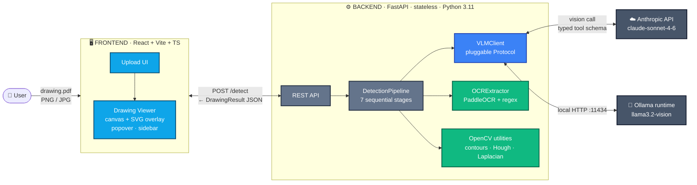
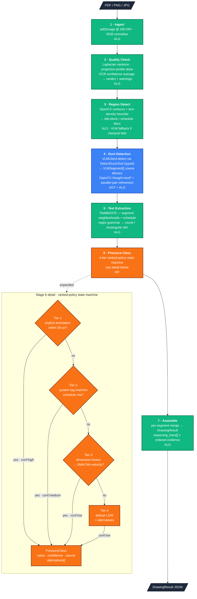

# HVAC Duct Detection & Annotation — Solution Design (v1.0)

> **Status:** Accepted, build-ready. Locks scope, names seams, decomposes the pipeline into algorithmic, workflow, and agent stages.
> **Author:** Arjun Sarath
> **Date:** 2026-05-02
> **Time budget:** 2 days
> **Companion artifacts:** [`PRD.md`](./PRD.md), [`research-report.html`](./research-report.html), [`adr/`](./adr/)

---

## 1. Purpose

The PRD defined the *problem*. The research report validated the *wedge*. This document defines the *build*: what we are implementing in v1, what we are deliberately not implementing, the named seams in the system, and the decomposition that keeps as much of the pipeline as possible deterministic.

The design posture is explicit:

1. **Algorithmic-first.** If a stage can be a deterministic function, it is.
2. **Workflow-second.** If a stage can be a state machine over deterministic stages, it is.
3. **Agent-only-with-tools.** When a VLM is invoked, it is invoked through a typed tool interface — no freeform JSON-from-prose, no open-ended reasoning.
4. **Predictable over clever.** Any decision that trades determinism for nominal accuracy gain has to clear a high bar in an ADR.

---

## 2. Scope

### 2.1 In scope (v1)

**Functional**
- Single-page PDF or image (PNG/JPG) upload
- Duct segment detection — rectangular and round
- Dimension extraction — `14"⌀`, `10" x 8"`, etc., via OCR + regex grammar
- Pressure-class classification — 4-tier ranked policy (see ADR-0004)
- Annotation overlay — SVG over the original raster, color-keyed by pressure class
- Click-to-inspect popover — dimension, PC, confidence, **reasoning trace**
- Collapsible right sidebar — sortable detection list, aggregate stats
- Drawing-quality detection — algorithmic, with user warning when below threshold
- Auto-grayscale filter when source is colored

**Architecture**
- Python 3.11 + FastAPI backend, stateless
- React + Vite + TypeScript frontend
- Pluggable `VLMClient` interface (Claude prod default, Ollama local dev) — see ADR-0002
- Single `docker compose up` runs the stack
- Pydantic schemas as the API contract source of truth

**Documentation**
- README — run instructions, assumptions, limitations, observed accuracy gap
- 5 ADRs — covering the load-bearing decisions
- Demo video under 3 minutes
- 5 benchmark drawings committed (or referenced) in the repo

### 2.2 Out of scope (v1)

**Out per PRD §5.2**
- Multi-page drawing sets
- Fitting-level detection (elbows, tees, dampers, diffusers)
- Native CAD parsing (DWG/RVT/IFC)
- Edit/approve workflow
- Export (CSV/IFC/Revit)
- 3D reconstruction or volumetric analysis

**Out per take-home practicality**
- Authentication, multi-user, RBAC
- Persistent storage / past-run history (see ADR-0005)
- Spec-PDF (SMACNA §23 31 13) ingestion — research "moat", explicitly v2
- Cross-source conflict detection — research insight, explicitly v2
- Fine-tuned ML detector (no labeled data; pretrained-only)
- Production hosting / public demo URL
- Real-time collaboration, mobile UI
- Flat-oval ducts (rare, deferred)
- Hand-drawn / heavily marked-up drawings — degrade gracefully, don't optimize

---

## 3. Architecture

Two views — high-level system context (what crosses each boundary) and low-level pipeline detail (how the seven stages compose, with the pressure-class state machine surfaced).

> **Diagram format note.** Each diagram is provided as both a Mermaid block (renders natively on GitHub, GitLab, VS Code preview, and most modern markdown viewers) and an ASCII fallback inside a collapsible `<details>` block (for terminal viewers, code-only tools, and screen readers).

### 3.1 High-level — system context



<details>
<summary><b>ASCII fallback — high-level system context</b> (click to expand)</summary>

```
                  ┌──────────┐
                  │  👤 User │
                  └────┬─────┘
                       │ drawing.pdf / png / jpg
                       ▼
   ┌──────────────────────────────────────────────────────┐
   │  🖥  FRONTEND          React + Vite + TypeScript      │
   │                                                      │
   │      Upload UI ──▶ Drawing Viewer                    │
   │                    (canvas + SVG overlay,            │
   │                     popover, sidebar)                │
   └─────────────────────────┬────────────────────────────┘
                             │
        POST /detect (multipart)  ◀──▶  DrawingResult JSON
                             │
                             ▼
   ┌──────────────────────────────────────────────────────┐
   │  ⚙  BACKEND           FastAPI · stateless · Py 3.11  │
   │                                                      │
   │      REST API                                        │
   │         │                                            │
   │         ▼                                            │
   │      DetectionPipeline (7 sequential stages)         │
   │         │                                            │
   │         ├────────────┬──────────────┬───────────┐    │
   │         ▼            ▼              ▼           │    │
   │   ┌──────────┐ ┌────────────┐ ┌──────────────┐  │    │
   │   │VLMClient │ │OCRExtractor│ │OpenCV utils  │  │    │
   │   │  AGT     │ │   ALG      │ │    ALG       │  │    │
   │   │pluggable │ │PaddleOCR   │ │contours/     │  │    │
   │   │protocol  │ │+ regex     │ │Hough/        │  │    │
   │   │          │ │grammar     │ │Laplacian     │  │    │
   │   └────┬─────┘ └────────────┘ └──────────────┘  │    │
   └────────┼─────────────────────────────────────────────┘
            │
            ├──────────────────┐
            ▼                  ▼
       ┌──────────┐      ┌──────────────┐
       │ ☁  Anth- │      │ 🐳 Ollama    │
       │  ropic   │      │   runtime    │
       │  API     │      │  :11434      │
       │ Sonnet   │      │ llama3.2-    │
       │  4-6     │      │  vision      │
       └──────────┘      └──────────────┘

  Legend:  AGT = agent (typed tool)   ALG = algorithmic
```
</details>

The frontend, backend, and external dependencies each occupy a distinct layer. Inside the backend, three sibling components serve the pipeline: `VLMClient` (agent), `OCRExtractor` (algorithmic), and the OpenCV utility layer (algorithmic). They are peer-level architectural concerns — none subordinate to the others.

### 3.2 Low-level — pipeline detail



<details>
<summary><b>ASCII fallback — pipeline detail</b> (click to expand)</summary>

```
                ┌─────────────────────────────┐
                │  PDF / PNG / JPG (upload)   │
                └──────────────┬──────────────┘
                               ▼
   ┌─────────────────────────────────────────────────────┐
   │ 1 · INGEST                                  [ALG]   │
   │   pdf2image @ 200 DPI · RGB normalize               │
   └────────────────────────┬────────────────────────────┘
                            ▼
   ┌─────────────────────────────────────────────────────┐
   │ 2 · QUALITY CHECK                           [ALG]   │
   │   Laplacian variance · projection-profile skew      │
   │   OCR confidence avg → verdict + warnings           │
   └────────────────────────┬────────────────────────────┘
                            ▼
   ┌─────────────────────────────────────────────────────┐
   │ 3 · REGION DETECT                  [ALG + VLM fb]   │
   │   OpenCV contours + text-density heuristic          │
   │   → title-block / schedule bbox                     │
   │   VLM fallback only if classical pass fails         │
   └────────────────────────┬────────────────────────────┘
                            ▼
   ┌─────────────────────────────────────────────────────┐
   │ 4 · DUCT DETECTION                  [AGT + ALG]  ◀━━━ only agent stage
   │   VLMClient.detect via DetectDuctsTool              │
   │   (typed Pydantic schema · structured output)       │
   │   → VLMSegment[] coarse bboxes                      │
   │   OpenCV HoughLinesP + parallel-pair refinement     │
   │   → tightened polylines                             │
   └────────────────────────┬────────────────────────────┘
                            ▼
   ┌─────────────────────────────────────────────────────┐
   │ 5 · TEXT EXTRACTION                         [ALG]   │
   │   PaddleOCR — segment neighborhoods                 │
   │   PaddleOCR — schedule region (PP-Structure)        │
   │   regex grammar parser → round / rectangular dim    │
   └────────────────────────┬────────────────────────────┘
                            ▼
   ┌─────────────────────────────────────────────────────┐
   │ 6 · PRESSURE CLASS                          [WF]    │
   │  ┌───────────────────────────────────────────────┐  │
   │  │ Tier 1: explicit annotation within 30 px?     │  │
   │  │   yes ─▶ conf:high  ─────────────┐            │  │
   │  │   no                              │           │  │
   │  │   ▼                               │           │  │
   │  │ Tier 2: system tag in schedule row?           │  │
   │  │   yes ─▶ conf:medium ────────────┤            │  │
   │  │   no                              │           │  │
   │  │   ▼                               │           │  │
   │  │ Tier 3: dim → SMACNA velocity?                │  │
   │  │   yes ─▶ conf:low   ─────────────┤            │  │
   │  │   no                              │           │  │
   │  │   ▼                               ▼           │  │
   │  │ Tier 4: default LOW + alternatives            │  │
   │  │         conf:low ──┴─▶ PressureClass          │  │
   │  └───────────────────────────────────────────────┘  │
   └────────────────────────┬────────────────────────────┘
                            ▼
   ┌─────────────────────────────────────────────────────┐
   │ 7 · ASSEMBLE                                [ALG]   │
   │   per-segment merge → DrawingResult                 │
   │   reasoning_trace[] = ordered evidence per stage    │
   └────────────────────────┬────────────────────────────┘
                            ▼
                ┌─────────────────────────────┐
                │  DrawingResult JSON          │
                └─────────────────────────────┘

  Legend:  ALG = algorithmic   WF = workflow / state machine
           AGT = agent (typed tool schema)
```
</details>

**Reading the stage colors**

- 🟢 **ALG** (green) — pure algorithmic; deterministic input → output, no inference
- 🟠 **WF** (amber/orange) — workflow / state machine; deterministic branching over algorithmic stages
- 🔵 **AGT** (blue) — agent invocation; VLM through a typed tool schema, structured output only

Of the seven stages, six are algorithmic or workflow. Stage 4 is the only agent invocation in the default path, and it is constrained to a single tool call (`DetectDuctsTool`) with a typed Pydantic schema — no JSON-from-prose parsing, no freeform reasoning. Stages 3 and 5 use OpenCV and PaddleOCR respectively as their primary engine; stage 3 has a VLM fallback gated on classical-pass failure, stage 5 does not.

---

## 4. Pipeline decomposition

| # | Stage | Type | Implementation summary |
|---|---|---|---|
| 1 | Ingest | ALG | `pdf2image` rasterizes PDFs at 200 DPI; PNG/JPG passes through; outputs a normalized RGB array. |
| 2 | Quality check | ALG | Laplacian variance for blur, projection profile for skew, OCR-confidence average over a sample region. Three numeric scores, three thresholds, one `quality: high \| medium \| low` verdict. Surfaces a UI banner when low. |
| 3 | Region detect | ALG+ | Classical pass first — rectangular border + text-density heuristic for the title block (typically lower-right). VLM fallback only if the classical pass returns no candidate. |
| 4 | Duct detection | AGT + ALG | VLM invocation via `VLMClient.detect(image)` returns a typed `DetectionResult` with coarse segment regions. OpenCV runs `HoughLinesP` + parallel-line pairing on each region to tighten geometry. The VLM is the only agent in the hot path; it answers exactly one question through a typed tool. |
| 5 | Text extraction | ALG | PaddleOCR over each segment neighborhood + over the schedule region. A regex grammar parses dimension callouts (`(\d+)"\s*[⌀ø]` for round, `(\d+)"\s*x\s*(\d+)"` for rectangular). Strings that don't match the grammar are not emitted. |
| 6 | Pressure-class | WF | Deterministic state machine — see ADR-0004. Inputs: per-segment OCR strings, schedule rows, system tag, dimension. Output: `{ value, confidence, source }` with no inference. |
| 7 | Assemble | ALG | Per-segment merge of stage outputs into the response schema. Reasoning trace is the ordered list of stage outputs that led to each `dimension` and `pressure_class` value. |

The system reaches into a VLM **once per drawing** in the default path (stage 4). Stages 3 and 6 have VLM fallbacks that are gated on classical-pass failure — instrumented so we can measure how often the fallback fires.

---

## 5. Named seams

### 5.1 Backend interfaces

```python
# app/vlm/base.py
class VLMClient(Protocol):
    """Pluggable agent boundary. ADR-0002. Stage 4 (and stage 3/5 fallbacks)."""
    def detect(self, image: PILImage, *, prompt_version: str = "v1") -> DetectionResult: ...
    def disambiguate_region(self, crop: PILImage, question: str) -> str: ...

# app/ocr/base.py
class OCRExtractor(Protocol):
    """Pluggable OCR boundary. ADR-0006. Stage 5 + stage 2 quality input."""
    def extract_text(self, image: PILImage, region: Bbox | None = None) -> list[OCRMatch]: ...
    def extract_table(self, image: PILImage, region: Bbox) -> Table: ...

# app/cv/base.py
class CVDetector(Protocol):
    """Algorithmic CV utilities. Used by stages 2, 3, 4 (refinement)."""
    def quality_metrics(self, image: PILImage) -> QualityMetrics: ...           # stage 2
    def find_title_block(self, image: PILImage) -> Bbox | None: ...             # stage 3
    def refine_segment_geometry(self, image: PILImage, bbox: Bbox) -> Polyline: ... # stage 4

# app/pipeline/base.py
class PipelineStage(Protocol):
    name: str
    def run(self, ctx: PipelineContext) -> PipelineContext: ...

class DetectionPipeline:
    stages: list[PipelineStage]      # ingest, quality, region, detect, extract, classify, assemble
    vlm: VLMClient                   # injected
    ocr: OCRExtractor                # injected
    cv: CVDetector                   # injected
    def run(self, file: UploadFile) -> DrawingResult: ...

# app/pipeline/classify.py
class PressureClassClassifier:
    """Deterministic ranked-confidence policy. No inference. ADR-0004."""
    def classify(self, segment: Segment, schedule: Schedule | None) -> PressureClass: ...
```

### 5.2 Pydantic schemas (API contract)

```python
class Geometry(BaseModel):
    type: Literal["polyline", "bbox"]
    points: list[tuple[float, float]]

class Dimension(BaseModel):
    value: str                       # "14\"⌀" or "10\" x 8\""
    shape: Literal["round", "rectangular"]
    confidence: Literal["high", "medium", "low"]
    source: str                      # e.g. "ocr:near_segment(d=12px)"

class PressureClass(BaseModel):
    value: Literal["LOW", "MEDIUM", "HIGH"]
    confidence: Literal["high", "medium", "low"]
    source: str                      # e.g. "schedule:DUCT-SCHED-2/row-B4"
    alternatives: list[str] = []     # values from other policy tiers

class ReasoningStep(BaseModel):
    stage: str                       # "vlm_detect" | "ocr_callout" | "schedule_lookup" | ...
    evidence: str                    # human-readable explanation

class Segment(BaseModel):
    id: str
    geometry: Geometry
    dimension: Dimension
    pressure_class: PressureClass
    reasoning_trace: list[ReasoningStep]

class Quality(BaseModel):
    overall: Literal["high", "medium", "low"]
    blur_score: float
    skew_degrees: float
    ocr_confidence_avg: float
    warnings: list[str]

class DrawingResult(BaseModel):
    drawing_id: str
    width_px: int
    height_px: int
    quality: Quality
    segments: list[Segment]
    aggregate: AggregateStats
```

### 5.3 Frontend prop seams

```typescript
// src/components/Canvas.tsx
type CanvasProps = {
  imageUrl: string;
  segments: Segment[];
  selectedId: string | null;
  onSelect: (id: string) => void;
  grayscale: boolean;
};

// src/components/Popover.tsx
type PopoverProps = {
  segment: Segment;
  anchor: { x: number; y: number };
  onClose: () => void;
};

// src/components/Sidebar.tsx
type SidebarProps = {
  segments: Segment[];
  aggregate: AggregateStats;
  selectedId: string | null;
  onSelect: (id: string) => void;
  collapsed: boolean;
  onToggle: () => void;
};
```

### 5.4 Tool interface for the VLM agent stage

```python
# app/vlm/tools.py
class DetectDuctsTool(BaseModel):
    """Tool the VLM is required to call. No freeform JSON parsing."""
    segments: list[VLMSegment]

class VLMSegment(BaseModel):
    bbox: tuple[float, float, float, float]
    shape_hint: Literal["round", "rectangular", "unknown"]
    nearby_text: list[str]           # raw text the VLM saw nearby; OCR is the source of truth
```

The VLM is constrained to call `DetectDuctsTool` once per image. We do not interpret freeform model output. If the call fails or returns malformed data, the pipeline degrades to OpenCV-only detection and surfaces a warning.

---

## 6. Data flow — one drawing, end to end

1. User uploads `drawing.pdf` → frontend POSTs to `/detect`.
2. Backend rasterizes to 200 DPI PNG.
3. Quality check returns `quality: medium, warnings: ["mild skew detected"]`.
4. Region detect finds title block at `(2400, 1800, 800, 600)`.
5. VLM detection returns 17 candidate duct segments with bounding boxes.
6. OpenCV refines segment geometry — 14 segments survive, 3 are merged into 1 (parallel pairing).
7. PaddleOCR runs over each segment's neighborhood + over the title-block region.
8. Pressure-class state machine runs per segment:
   - Segment 1: OCR found `"LOW PRESS"` at distance 8px → `LOW, high, "ocr:near_segment"`
   - Segment 2: no nearby annotation; system tag `SA-1` matches schedule row → `MEDIUM, medium, "schedule:DUCT-SCHED/SA-1"`
   - Segment 3: no annotation, no schedule match; dimension `12" x 8"` + SMACNA velocity assumption → `LOW, low, "smacna:velocity_heuristic(2000fpm)"`
9. Reasoning trace assembled per segment.
10. JSON returned. Total stages: 7. VLM calls: 1. Total latency target: ≤30s P50 (PRD §9.1).

---

## 7. UI behavior

- Drawing renders to an HTML5 `<canvas>` at native resolution, scaled to fit.
- If source detected as colored (RGB variance above threshold), apply CSS `filter: grayscale(1)` for overlay contrast.
- SVG overlay layer sits above the canvas, sized to match. Each segment renders as a polyline / bbox stroke in pressure-class-keyed color:
  - `LOW` — green (`#059669`)
  - `MEDIUM` — amber (`#ea580c`)
  - `HIGH` — red (`#dc2626`)
  - low-confidence segments get a dashed stroke instead of solid
- Hover → segment highlights (stroke widens, fill at 0.2 opacity).
- Click → popover anchored at cursor with dimension, PC, confidence badge, reasoning trace (collapsed accordion).
- Right sidebar: sortable detection list (by ID, dimension, PC, confidence), aggregate panel (count by PC, total linear-ft estimate at drawing scale, quality verdict).
- Quality warning banner — appears as a top-of-frame strip when `quality.overall === "low"` or `"medium"` with content from `quality.warnings`.

Click-to-inspect target latency: ≤200 ms (PRD §9.1) — the popover is a pure React render against already-loaded JSON, so this is comfortable.

---

## 8. Edge-case policy

| Case | Behavior |
|---|---|
| Scanned drawing, low DPI / heavy skew | Quality check sets `quality: low`, banner warns user, pipeline still runs, results carry low confidence. |
| Hand-drawn / heavily marked up | VLM detection will likely under-recall. Banner warns user. README documents this as a known limit. |
| Pressure class only in title-block schedule | **Expected case.** Schedule lookup tier of the ranked policy fires. `confidence: medium`. |
| No PC information anywhere | SMACNA velocity heuristic fires. `confidence: low`. Reasoning trace explicitly says "no annotation, no schedule match". |
| Mixed systems on one sheet | System-tag → schedule mapping respected. PC may differ across segments — this is correct. |
| Round + rectangular + flat-oval | Round and rectangular detected and dimensioned. Flat-oval not optimized; if detected as rectangular, that's documented. |
| Non-HVAC line work (structural, piping, electrical) | VLM filters by context. False positives surface in the demo and are documented honestly. |
| Multiple ducts at a fitting | Segments break at intersections — no fitting classification, just boundary breaks. |
| VLM call fails or times out | Pipeline degrades to OpenCV-only detection. Banner: "automated detection unavailable, geometry-only mode". |
| OCR returns nothing for a segment | Dimension renders as "—", confidence "low", reasoning trace says "no callout text within 30px radius". |
| Drawing is not a plan view at all (e.g., a detail or schedule sheet) | Quality check + region detect together flag `unsupported_drawing_type`. Banner asks for a plan view. |

---

## 9. Failure modes & error handling

| Failure | Detection | Response |
|---|---|---|
| Upload not PDF/PNG/JPG | API validation | 400 with explicit error |
| PDF has multiple pages | Pipeline ingest stage | 400 with "single-page only — upload page N separately" |
| Drawing exceeds size cap (50 MB / 8000×8000 px) | API validation | 413 with explicit limit |
| VLM API key missing | Startup config check | 500 with "configure ANTHROPIC_API_KEY or set VLM_PROVIDER=ollama" |
| VLM rate-limited | `VLMClient.detect` retries with exponential backoff (3 tries) | If still failing, degrade to CV-only path with banner |
| Ollama not reachable | `OllamaVisionClient.detect` health-check at startup | 503 if requested provider isn't ready |
| Pipeline stage exception | `PipelineStage.run` catches, logs, returns partial result with `errors[]` | UI shows "partial result" banner; surfaces what stage failed |

---

## 10. Day-1 / Day-2 plan

### Day 1 — backend + benchmark

| Hr | Work | Tag |
|---|---|---|
| 0:00–0:45 | Repo scaffold (FastAPI, React, docker-compose), Pydantic schemas, smoke health-check endpoint | INT |
| 0:45–1:45 | Source 5 benchmark drawings into `drawings/` directory + provenance notes in README | DATA |
| 1:45–2:30 | Ingest stage (PDF→raster, normalize) — pure algorithmic | ALG |
| 2:30–3:30 | Quality-check stage (Laplacian + skew + OCR-conf threshold) — pure algorithmic | ALG |
| 3:30–4:30 | `VLMClient` interface + `ClaudeVisionClient` impl + `DetectDuctsTool` schema | INT |
| 4:30–5:30 | Detect stage end-to-end: VLM call → CV refinement | AGT+ALG |
| 5:30–6:30 | Text extraction stage (PaddleOCR + regex dimension grammar) | ALG |
| 6:30–7:15 | Pressure-class state machine (ADR-0004 implementation) | WF |
| 7:15–8:00 | Assemble stage + end-to-end run on 1 benchmark drawing, sanity-check output | INT |
| 8:00–8:45 | `OllamaVisionClient` parity, env-var swap | INT |

### Day 2 — frontend + polish

| Hr | Work | Tag |
|---|---|---|
| 0:00–1:00 | React canvas + raster render + auto-grayscale | INT |
| 1:00–2:00 | SVG overlay layer, PC-keyed colors, hover highlighting | INT |
| 2:00–2:45 | Click handler + popover with reasoning trace accordion | INT |
| 2:45–4:00 | Sidebar (sortable list + aggregate stats + quality banner) | INT |
| 4:00–5:00 | Run pipeline on all 5 benchmark drawings, capture failure modes | DATA |
| 5:00–6:00 | Iterate on the worst failure mode (likely OCR or PC fallback) | ALG |
| 6:00–7:00 | README — assumptions, limitations, run instructions, accuracy table | DOC |
| 7:00–8:00 | Demo video record (<3 min) + final repo polish | DOC |

Tags: ALG = algorithmic · WF = workflow · AGT = agent-with-tools · INT = integration · DATA = benchmark/drawing work · DOC = documentation

---

## 11. Open engineering questions (resolve during build)

These are the questions whose answers are best discovered with a working pipeline in front of you, not on a whiteboard.

1. **Working DPI for raster.** 200 DPI is the starting point. Resolve based on first-drawing PaddleOCR readings.
2. **OCR engine.** PaddleOCR is the default. If it under-performs on engineering typography, swap to Tesseract or RapidOCR. Time-boxed to 1 hour during day 1.
3. **VLM prompt versioning.** The detect prompt lives at `app/vlm/prompts/detect_v1.md` and is versioned. Iteration during day 1 is expected.
4. **Geometry refinement strictness.** OpenCV `HoughLinesP` parameters tuned per drawing — first try fixed defaults, only adapt if recall is too low.
5. **Schedule-region OCR mode.** PaddleOCR table mode vs. plain OCR. First try plain, escalate only if column inference fails.

---

## 12. Out-of-band considerations

- **Privacy / IP.** The 5 benchmark drawings are from public sources. README documents provenance. No customer drawings, no hand-rolled NDAs.
- **API costs.** One Claude vision call per drawing is the only paid hop. Estimate <$0.05/drawing at current pricing.
- **Demo reproducibility.** `docker compose up` with sample env file should reproduce the demo without an API key (Ollama path).
- **Reviewer experience.** README has a 30-second "what to look at first" section — the reasoning trace, the schedule-lookup case, the low-quality drawing handling. These are the three highest-signal artifacts of the system thinking.

---

## 13. References

- [`PRD.md`](./PRD.md) — problem statement, target users, goals, non-goals, edge cases
- [`research-report.html`](./research-report.html) — synthetic user research, wedge reframe, ICP resolution
- [`competitor-research.md`](./competitor-research.md) — TaksoAI capability map, positioning gap
- [`adr/0001-hybrid-detection-stack.md`](./adr/0001-hybrid-detection-stack.md)
- [`adr/0002-pluggable-vlm-client.md`](./adr/0002-pluggable-vlm-client.md)
- [`adr/0003-workflow-first-agent-with-tools.md`](./adr/0003-workflow-first-agent-with-tools.md)
- [`adr/0004-pressure-class-ranked-policy.md`](./adr/0004-pressure-class-ranked-policy.md)
- [`adr/0005-stateless-backend.md`](./adr/0005-stateless-backend.md)
- [`adr/0006-ocr-engine-paddleocr.md`](./adr/0006-ocr-engine-paddleocr.md)

---

*Build-ready as of 2026-05-02. Scope is locked. Changes after this point require a new ADR.*
